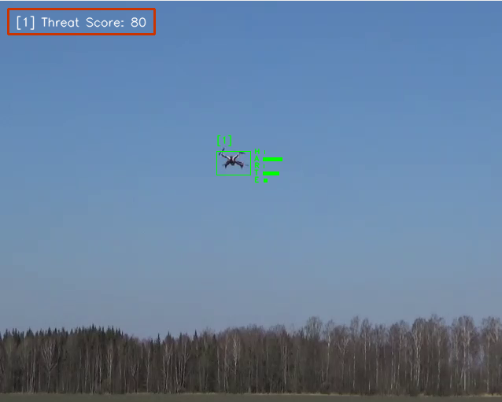

# Drone detection and tracking
 

This repository provides a complete system for detecting and tracking drones in video streams, using their flight patterns to classify behaviour and assess potential threats
## Approach

1. [Detection](#1.-Detection)
2. [Tracking](#2-tracking)
3. [Classification](#3-classification)
4. [Threat assessment](#4-threat-assessment)


### 1. Detection
Yolov11 - Ultralytics 
Training data: https://github.com/Maciullo/DroneDetectionDataset 
Note: Visual Only

### 2. Tracking
Multi-object tracking and ReID

1. Deep Sort  - https://github.com/levan92/deep_sort_realtime
2. Ultralytics - https://docs.ultralytics.com/modes/track/

The Ultralytics ReID performed the best.

A kalman filter is used to smooth the tracking results.

### 3. Classification
Each track contains a history of their state - the output of the Kalman filter: x,y,w,h,vx,vy,vh,vw

From this state history features are generated which are used to estimate the behaviour of the drone. 
The features used are: 
* average speed
* average approach velocity
* standard deviation of the xy direction

Using these features scoring functions are used to estimate the likelihood of a certain behaviour.

* Hovering: speed zero
* Travelling: High speed and stable direction
* Attacking: High approach velocity
* Retreating: Negative approach velocity
* Evading: High speed and unstable direction

### 4. Threat assessment
The behaviour likelihoods are then used to calculate a threat score.

This is calculated from a weighted sum of the following:
* Attacking likelihood
* Proximity: estimate of how close the drone is to the camera
* Approach Velocity

Note:
`vw` is used a s proxy for distance. This was a more stable measure than using the area, particularly when a drone maneuvers.


### Limitations

- The Kalman filter is crudely tuned.
- Objet detector struggles with small objects
- The state history window used for behaviour classification is not optimised
- The threat assessment weights are not optimal


## Software design

Almost all aspects of the system are controllable via the [config file](config/config.yaml) implemented with [Hydra](https://hydra.cc/)

The components are implemented as classes and create using the factory method pattern via the config file.

Note: the YOLO tracker has a separate config file. This can be one of two;[ botsort.yml](config/botsort.yml) or [bytesort.yml](config/bytesort.yml). 

### Visualisation

Example



Threat score is drawn for each valid track in the top left (0-100) 0 is low threat.

The green tracked box has a tack id and histogram showing the behaviour likelihoods; H=Hover, A=Attacking etc.

#### User control
* When running the script will exit upon the video finishing. 
* To manually exit press "q"
* To pause the video press "p", this will enable frame by frame stepping by pressing the space bar. To resume the video press "p" again.


## Installation

A gpu is recommend to improve the object detection speed.

### Conda (recommended)

```shell 
conda create -y -n drone_detection python=3.10
conda activate drone_detection
pip install -r requirements.txt
pip install -e .
```

## Running

All settings can be controlled via the [config file](config/config.yaml). 

By default the settings file assumes videos are in [data/videos](data/videos) (this will be empty after a fresh clone). This can be change via the `grabber.parameters.video_root_dir` 

Either add your video to that folder and set them in the config file `grabber.parameters.video_path` relative to that folder, or use absolute filename. 

Note: `grabber.parameters.video_path` be a list, the script will loop through the videos.

```python
python drone_detection/main.py
```

Alternatively, settings can be controlled via the command line. 
e.g. to select a different video file

```python
python drone_detection/main.py grabber.parameters.video_path=<your_video_file> 
```

Note - if you use a relative path for `<your_vide_file>` the script will first search for file in `grabber.parameters.video_root_dir`. 
If it cannot find a match it assumes it is relative to where you are running the script from.


### Demo

A demo video can be found [here](data/demo.mp4)